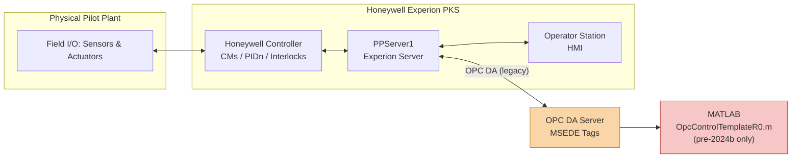
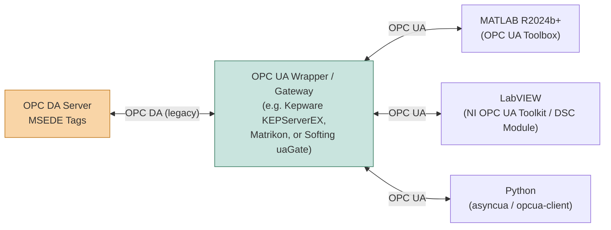

# Pilot Plant Handover Documentation

This repository contains the handover documentation, control system design records, and supporting resources for the **MU Pilot Plant (MUPP)**. It is intended to provide future students, and researchers with the context, design rationale, and reference material needed to understand, operate, maintain, and extend the pilot plant's control system.

To the repository owners knowledge, the contents are complete. 
**IF A DOCUMENT EXISTS DESCRIBING OR OUTLINING THE PLANT, IT IS HIGHLY UNLIKELY THAT IT IS NOT IN THIS REPO**

## Overview

The pilot plant is a shared experimental facility used for process control research and teaching. Its control system has undergone multiple revisions over time, most recently the **2022 Controller Revision**, which forms the bulk of the surface level documentation in this handover. This repository captures that revision's design, implementation, and proof of function, along with supporting legacy material from earlier work on the plant.

## Control System Architecture: Honeywell Experion PKS

The pilot plant is controlled by a Honeywell C300 controller, configured and maintained by the **Honeywell Experion (PKS)** application package, a Distributed Control System (DCS). The system is comprised of a hardware controller (executing the Control Modules / CMs, PID loops, and interlocks documented in this handover), an Experion server (`PPServer1`), and remotely accessible operator station(s) used for supervisory control and monitoring (see **PP-5002**).

External programs (e.g. MATLAB) do not talk to the Honeywell controller directly. Instead, communication happens via an **OPC DA server** sitting between Experion and the outside world, exposing plant tags that external clients can read/write (see **PP-1001** and **PP-5007**).



### Key Limitation: OPC DA-only Communication

The Honeywell controller/Experion stack in this installation **only exposes OPC Data Access (OPC DA)** — an older, Windows-COM/DCOM-based protocol from the OPC Classic specification. It does **not** support **OPC UA** (Unified Architecture), the modern, platform-independent, service-oriented successor protocol.

This has significant practical consequences for interfacing with modern tooling:

- **MATLAB removed native OPC DA support in R2024b.** The OPC Toolbox's classic `opcda` client functionality was deprecated and then removed, with Mathworks steering users toward OPC UA instead. Since **This** version of experion only speaks OPC DA, **MATLAB versions from R2024b onward cannot connect to the plant using the built-in OPC Toolbox workflow** used by `OpcControlTemplateR0.m`.
- Any lab machine or workflow that needs to use `OpcControlTemplateR0.m` (or similar direct MATLAB-to-plant control) must remain on a **pre-2024b MATLAB release** with the legacy OPC Toolbox, or use an intermediate bridge/gateway.
- OPC DA also requires DCOM configuration on Windows, which is increasingly difficult to support on modern OS versions and adds security/networking overhead not present with OPC UA.
- **Possible mitigations** for future revisions (not yet implemented, but worth investigating):
  - Introduce an **OPC DA-to-UA gateway/wrapper** (e.g. a middleware service) so modern clients (MATLAB R2024b+, Python, etc.) can connect via OPC UA while the gateway talks OPC DA to Experion.
  - Investigate whether the Experion server can be configured/upgraded to expose an OPC UA interface directly.
  - Keep a dedicated, version-pinned MATLAB installation (pre-R2024b) available specifically for OPC DA-based plant control, isolated from other lab software that may require newer MATLAB releases.

### Adding an OPC UA Wrapper: Considerations

If a future revision implements an OPC DA-to-UA gateway, it's worth designing it to be a **shared, general-purpose interface** rather than something bespoke to MATLAB, since **LabVIEW** and other environments would benifit from plant access.



Key points to keep in mind when scoping this work:

- **Off-the-shelf gateways exist** (e.g. Kepware/PTC KEPServerEX with its OPC UA plugin, Matrikon OPC UA Tunneller, Softing's uaGate/dataFEED products, or Ignition's OPC UA module) that already bridge OPC DA ↔ OPC UA without writing custom code. Using a proven commercial/free gateway is generally lower-risk than a bespoke wrapper.
- **A single shared OPC UA server means one consistent tag namespace** for all downstream clients (MATLAB, LabVIEW, Python, etc.), rather than each environment needing its own DA driver/DCOM setup. This also means tag naming conventions (see **PP-1001**) should be preserved or clearly re-mapped in the UA address space so existing documentation stays valid.
- **LabVIEW interoperability specifics:**
  - National Instruments' **OPC UA Toolkit** (or the **DSC Module**, which has supported OPC UA client/server functionality for some time) can consume the gateway's OPC UA endpoint directly, without needing NI's older/legacy OPC DA-specific tools.
  - LabVIEW's OPC UA support is generally more actively maintained than its DA support, so standardising on UA benefits LabVIEW-based workflows as much as it benefits MATLAB — this is a good opportunity to modernise both simultaneously rather than solving the problem twice.
  - Test **simultaneous multi-client access** (MATLAB and LabVIEW connected at the same time) early, since concurrent read/write from multiple UA clients to the same underlying DA tags can expose gateway licensing limits (many DA/UA gateways charge per tag or per concurrent connection) or update-rate contention.
- **Networking/deployment:** the gateway is typically installed on a Windows host with DCOM access to Experion (same constraints as today), but only *that one host* needs DCOM configured — all downstream clients talk pure OPC UA over standard TCP, which is far easier to route/firewall across the lab network than DCOM.
- **Documentation impact:** if this is implemented, a new PP-xxxx document should be created (in the style of **PP-1001**) describing the UA endpoint URL, security configuration, and tag/namespace mapping, so both MATLAB and LabVIEW users have a single reference.

## Repository Structure

```
PilotPlantHandoverDocumentation/
├── PP-0000 Pilot Plant Fire Extinguisher.pdf   # General troubleshooting guide for common plant problems/errors
└── 2023 Handover/                              # Main handover package (2022/2023 controller overhaul)
    ├── The MUPP - Control System Overhaul [Final].pdf   # Primary thesis/report describing the overhaul project
    ├── OpcControlTemplateR0.m                            # MATLAB OPC control template (R0) used for plant control
    ├── Legacy-Resources.zip                              # Archive of prior theses and older documentation (see below)
    ├── Documentation/                                     # Finalised PDF documentation (PP-xxxx numbered docs)
    │   └── Source Documents/                              # Editable .docx source files for the documents above
    └── Tables/                                            # Supporting spreadsheets (interlocks, limits, CM summaries)
```

### `2023 Handover/Documentation/`

Contains the finalised, numbered **PP-xxxx** documents describing the 2022 controller revision. These are the authoritative reference documents for the current control system:

| Document | Description |
|---|---|
| PP-0007 | PIDn_PvSp_SELECT Design |
| PP-0008 | PIDn_AutVar_SELECT Design |
| PP-0009 | Control Element CM Design |
| PP-1001 | OPC_MSEDE Tag Names and Communication |
| PP-1002 | Pilot Plant Interlocks |
| PP-1003 | 2022 Controller Revision - Proof of Function |
| PP-1004 | PPServer1 CM Summary |
| PP-4002 | Controller Design and Description |
| PP-5002 | Operating Pilot Plant via Station |
| PP-5007 | OPCControlTemplateR0 - Use and Function |
| PP-8003 | Upgrading to OR Downgrading from 2022 MUPP Update |

The `Source Documents/` subfolder contains the original editable `.docx` versions of these files, useful if updates or corrections need to be made in future.

### `2023 Handover/Tables/`

Reference spreadsheets used alongside the documentation:

- **Asset Interlock and Limit Tables.xlsx** – Interlock conditions and operating limits for plant assets.
- **intTableh.xlsx** – Supporting interlock table data.
- **New Revision Activation List.xlsx** – Checklist/list for activating a new controller revision.
- **Summary of MUPP CMs.xlsx** – Summary of Control Modules (CMs) implemented on the plant.

### `Legacy-Resources.zip`

An archive of older material predating the 2022 revision. This mainly consists of **previous students' theses** covering earlier work on the pilot plant and its control systems, along with other miscellaneous documentation that may still be useful for historical context, design rationale, or ideas not carried forward into later revisions. Worth reviewing when investigating why certain design decisions were made or when researching parts of the plant not covered by the current documentation.

> **Note:** This file is ~1.9GB, too large to host in this repository. It is available via OneDrive instead: [Legacy-Resources.zip](https://1drv.ms/u/c/6bf26ca1efb12cd5/IQCMphMw1OfLQbrzys4IJfJ5AWjd0vajjqSPFBA8FC1vriE?e=hrTRWj)

### `OpcControlTemplateR0.m`

A MATLAB script template used for OPC-based control of the pilot plant, referenced by **PP-5007**.

### `PP-0000 Pilot Plant Fire Extinguisher.pdf`

Despite the name, this document is a **general troubleshooting guide** for the pilot plant, covering the most common problems/errors encountered during operation and how to resolve them. A good first port of call when something goes wrong on the plant.

## Suggested Starting Points

- **New to the plant?** Start with *The MUPP - Control System Overhaul* thesis for a full narrative of the 2022 revision project, then read **PP-4002** (Controller Design and Description) and **PP-1002** (Pilot Plant Interlocks).
- **Operating the plant?** See **PP-5002** (Operating Pilot Plant via Station) and **PP-5007** (OPCControlTemplateR0 - Use and Function).
- **Making control changes?** Review **PP-0007/0008/0009** for PID and control element (CM) design patterns, and the `Tables/` spreadsheets for current interlocks and CM summaries.
- **Upgrading/downgrading revisions?** See **PP-8003**.
- **Researching older/legacy work?** Extract and browse `Legacy-Resources.zip` for prior theses and documentation.
- **Something's gone wrong on the plant?** Check **PP-0000** first for common problems/errors and their fixes before digging into individual design documents.

## Notes

- Editable `.docx` sources are kept alongside the finalised PDFs so documentation can be updated without starting from scratch.
- When making changes to the control system, update both the relevant PP-xxxx document and the `Tables/` spreadsheets to keep the handover documentation in sync with the live system.
